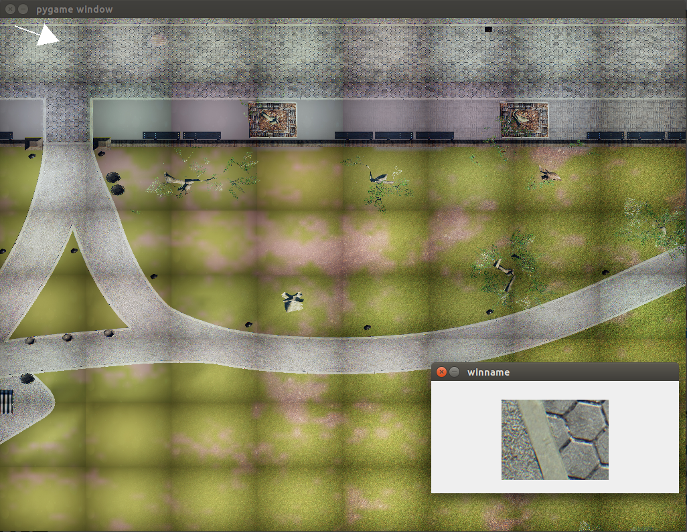

Среда gym для обучения обьезду препятсвий

# requirements
    - NVIDIA card

# install
git clone https://github.com/kantengri/bev_env
# install poetry
bash run.sh --install-poetry
# install environment
bash run.sh poetry install

# run
# Ручное управление
bash run.sh python manual_control.py

Управление:
! основное окно должно быть в фокусе
управление стрелками:
    LEFT/RIGHT - поворот влево-вправо
    UP/DOWN - движение вперед/назад
PGUP/PGDOWN - увеличить/уменьшить шаг

# training
bash run.sh python train.py
